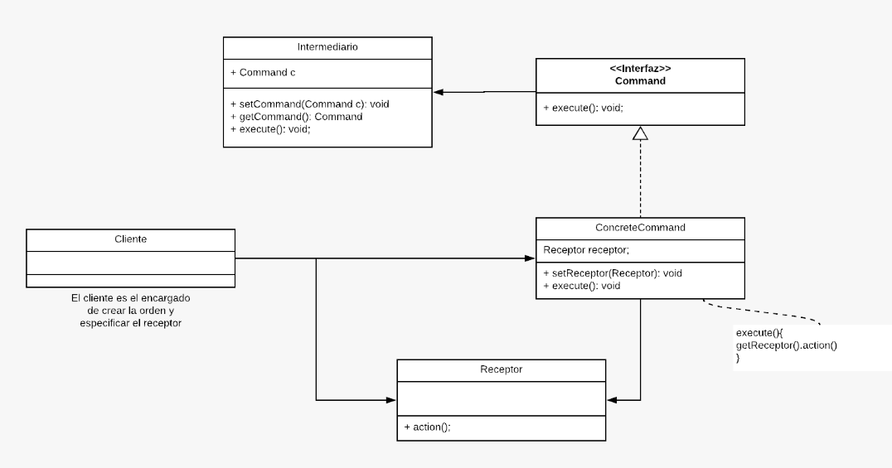

 # Estructura UML


## 1. Command (Comando - Interfaz o Clase Abstracta)
Define un contrato para ejecutar una operación. Todos los comandos concretos deben implementar esta interfaz o heredar de esta clase.
 - Responsabilidad: Declarar un método común (como execute()), que será implementado por los comandos concretos.
### Código de Ejemplo
```js
class Command {
    execute() {
        throw new Error("Este método debe ser implementado");
    }
}
```

## 2. Concrete Command (Comando Concreto)
Implementa la interfaz Command e invoca métodos específicos del receptor asociado.
 - Responsabilidad: Contiene la lógica para ejecutar una acción específica y puede almacenar detalles del estado necesario para realizarla.
 - Ejemplo: Comandos como TurnOnLightCommand o TurnOffLightCommand.
### Código de Ejemplo
```js
class TurnOnLightCommand extends Command {
    constructor(light) {
        super();
        this.light = light; // Receptor
    }
    execute() {
        this.light.turnOn();
    }
}

class TurnOffLightCommand extends Command {
    constructor(light) {
        super();
        this.light = light;
    }
    execute() {
        this.light.turnOff();
    }
}
```
## 3. Receiver (Receptor)
Es el objeto que realiza el trabajo real cuando se ejecuta un comando.
 - Responsabilidad: Contiene la lógica para realizar las operaciones solicitadas por el comando.
 - Ejemplo: Una clase Light que tiene los métodos turnOn() y turnOff().
### Código de Ejemplo
```js
class Light {
    turnOn() {
        console.log("La luz está encendida");
    }
    turnOff() {
        console.log("La luz está apagada");
    }
}
```

## 4. Invoker (Invocador)
Es el objeto que sabe cómo ejecutar un comando. El invocador no necesita conocer los detalles del comando, solo necesita llamarlo.
 - Responsabilidad: Disparar la ejecución de comandos. Puede almacenar una lista de comandos para ejecutar en el futuro (historial).
 - Ejemplo: Un control remoto que tiene un botón asociado a un comando.
### Código de Ejemplo
```js
class RemoteControl {
    setCommand(command) {
        this.command = command;
    }
    pressButton() {
        this.command.execute();
    }
}
```
## 5. Client (Cliente)
Es el responsable de configurar el comando, receptor e invocador.
 - Responsabilidad: Crear objetos de comandos concretos y asignarlos al invocador.
### Código de Ejemplo
```js
// Cliente
const light = new Light(); // Receptor

const turnOnCommand = new TurnOnLightCommand(light); // Comando concreto
const turnOffCommand = new TurnOffLightCommand(light);

const remote = new RemoteControl(); // Invocador

remote.setCommand(turnOnCommand);
remote.pressButton(); // La luz está encendida

remote.setCommand(turnOffCommand);
remote.pressButton(); // La luz está apagada
```