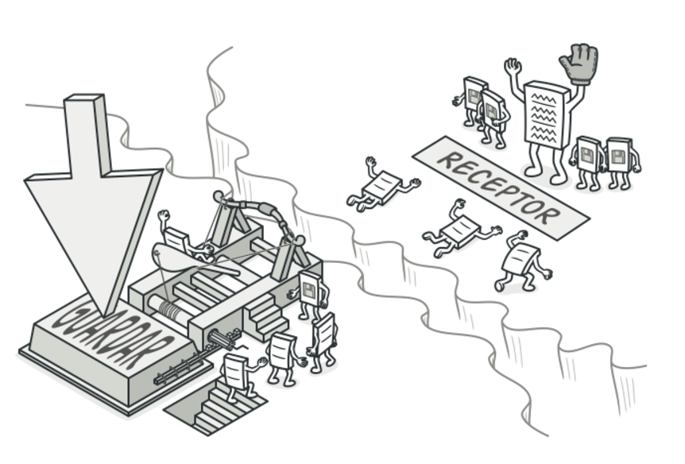

# Concepto
El patrón Command es un patrón de diseño de comportamiento que convierte las solicitudes o acciones en objetos independientes. Esto permite parametrizar métodos con comandos, retrasar la ejecución de una solicitud o registrar un historial de operaciones. El patrón Command es un patrón de diseño de comportamiento que encapsula una solicitud como un objeto, permitiendo parametrizar los objetos con diferentes solicitudes, colar solicitudes, registrar operaciones, y admitir la funcionalidad "deshacer" ( deshacer ).

Este patrón es ideal para sistemas en los que:
- Se necesita registrar acciones para poder repetirlas o deshacerlas.
- Se desea desacoplar el objeto que emite una solicitud del objeto que la ejecuta.
- Las solicitudes deben ser tratadas como objetos independientes que puedan ser manipulados (almacenados, encolados o enviados a través de la red).

## Cuando aplicarlo
-  Utiliza el patrón Command cuando quieras parametrizar objetos con operaciones.
- Utiliza el patrón Command cuando quieras poner operaciones en cola, programar su ejecución, o ejecutarlas de forma remota.
-  Utiliza el patrón Command cuando quieras implementar operaciones reversibles.

## Caracteristicas Clave
- Encapsulación de Solicitudes : Convierte una solicitud en un objeto independiente con toda la información necesaria para ejecutarla.
- Desacoplamiento : Separa el emisor (Invoker) del receptor (Receiver) de las solicitudes.
- Soporte para Deshacer/Rehacer : Al almacenar los comandos ejecutados, es posible deshacer operaciones o rehacerlas.

## Ventajas
- Proporciona flexibilidad al asignar diferentes comandos a los invocadores.
- Facilita la implementación de funciones de "deshacer" y "rehacer".
- Se puede colar y programar la ejecución de comandos para ejecutarse en un momento posterior.

## Desventajas
- Incrementa la cantidad de clases, ya que cada comando generalmente requiere una nueva clase.
- Puede introducir complejidades innecesarias si no se necesitan todas las capacidades del patrón.
