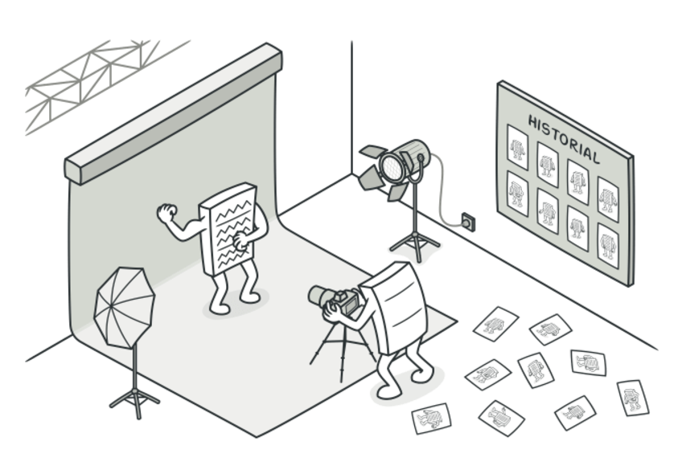

# Concepto
El Patrón Memento es un patrón de diseño de comportamiento cuyo propósito es capturar y almacenar el estado interno de un objeto en un momento específico, de manera que pueda ser restaurado más adelante sin violar la encapsulación del objeto. En este patrón, se define un objeto "Memento" que actúa como una instantánea del estado del objeto "Originador". El patrón sigue el principio de separación de responsabilidades: el objeto que necesita ser restaurado es responsable de crear y restaurar sus propios mementos, mientras que otro objeto (Caretaker) se encarga de almacenar y gestionar los mementos.

El Patrón Memento está diseñado para resolver problemas relacionados con el almacenamiento y restauración de estados complejos en sistemas donde el objeto debe mantenerse encapsulado. Es especialmente útil en situaciones donde:
- Se requiere implementar un mecanismo de "deshacer".
- Es necesario registrar los cambios del estado de un objeto a lo largo del tiempo.
- Se desea proteger el estado interno del objeto de modificaciones externas.

En lugar de permitir el acceso directo a los datos del objeto para guardar y restaurar estados, el patrón utiliza un enfoque encapsulado, donde solo el objeto propietario puede acceder a sus propios estados a través de un "Memento". Este diseño asegura que los detalles internos del objeto permanezcan ocultos para otros componentes del sistem

## Cuando aplicarlo
- Cuando se necesita un historial de estados o un mecanismo de deshacer.
- Cuando el estado interno del objeto debe ser encapsulado y protegido.
- Cuando el objeto puede cambiar frecuentemente y se necesita restaurar su estado anterior.

## Caracteristicas Clave
1. Encapsulación de Estado:
 - Protege los detalles internos del objeto (Originador) al encapsular el estado dentro de un Memento.
 - El estado solo es accesible para el Originador.

2. Historial de Estados:
 - Permite almacenar múltiples estados para habilitar la restauración a puntos específicos del tiempo.

3. Restauración de Estado:
 - Proporciona un mecanismo para regresar al estado anterior sin necesidad de duplicar la lógica en el objeto principal.

4. Separación de Responsabilidades:
 - Divide la lógica de almacenamiento de estados (Caretaker) de la lógica de negocio (Originador).

5. Soporte para Deshacer/Refactorizar:
 - Permite la implementación de funcionalidades de "deshacer" y "rehacer" de forma eficiente y escalable.

## Ventajas
1. Encapsulación Segura:
 - El estado interno del objeto no se expone, asegurando la integridad del diseño.

2. Fácil Implementación de "Deshacer":
 - Útil en aplicaciones donde se necesita navegar entre estados previos, como editores de texto o juegos.

3. Flexibilidad:
 - El patrón puede extenderse para soportar múltiples estados o diferentes versiones del estado de un objeto.

4. Independencia:
 - El cliente no necesita conocer los detalles del estado interno del objeto. Solo interactúa con el Caretaker y el Originador.

## Desventajas
1. Sobrecarga de Memoria:
 - Si se guardan demasiados mementos, puede haber un alto consumo de memoria, especialmente en objetos grandes o complejos.

2. Complejidad Adicional:
 - La implementación del patrón requiere la creación de múltiples clases (Originador, Memento y Caretaker), lo que puede añadir complejidad al diseño.

3. Limitaciones en Estados Complejos:
 - Si el estado incluye referencias a otros objetos o recursos externos, es difícil encapsularlo completamente en un Memento.

4. Sin Control de Versiones:
 - A diferencia de herramientas de control de versiones, los mementos no ofrecen comparación directa entre estados.