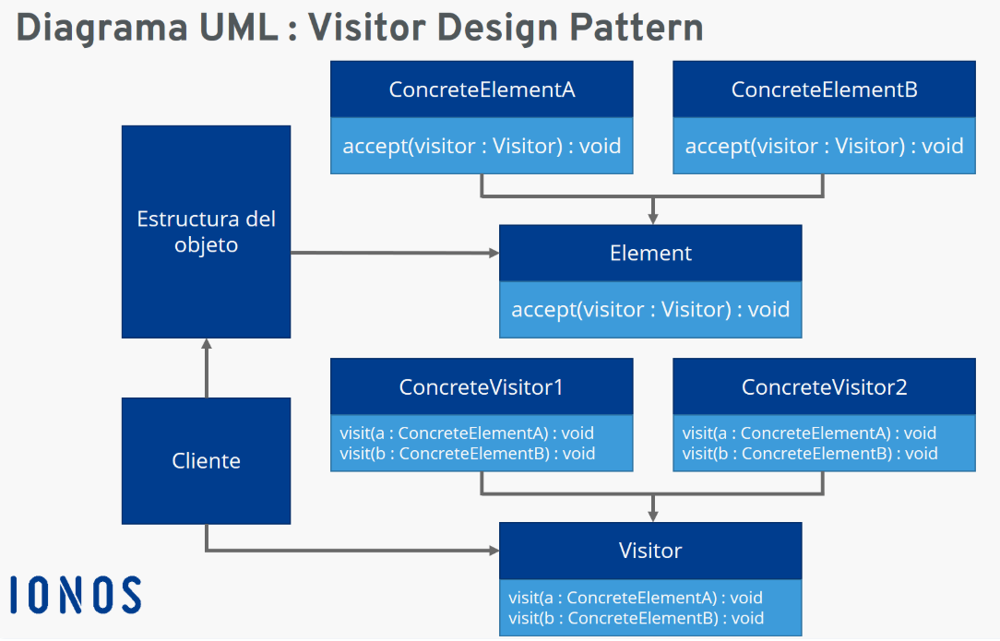

 # Estructura UML


## 1. Visitor (Visitante - Interfaz o Clase Abstracta)
Define un contrato para las operaciones específicas que se pueden realizar en los elementos concretos. Todos los visitantes concretos deben implementar esta interfaz o heredar de esta clase.
 - Responsabilidad: Declarar un método visit para cada tipo de elemento que pueda ser visitado.
 - Ejemplo: Métodos como visitConcreteElementA() y visitConcreteElementB().
### Código de Ejemplo
```js
interface Visitor {
    void visitConcreteElementA(ConcreteElementA element);
    void visitConcreteElementB(ConcreteElementB element);
}
```

## 2. Concrete Visitor (Visitante Concreto)
Implementa los métodos definidos en la interfaz Visitor. Cada visitante concreto representa una operación específica que puede realizarse en los elementos.
 - Responsabilidad: Proveer la implementación de la lógica específica para cada tipo de elemento.
 - Ejemplo: Visitantes como ExportVisitor o PrintVisitor.
### Código de Ejemplo
```js
class ExportVisitor implements Visitor {
    public void visitConcreteElementA(ConcreteElementA element) {
        System.out.println("Exportando ConcreteElementA: " + element.getName());
    }

    public void visitConcreteElementB(ConcreteElementB element) {
        System.out.println("Exportando ConcreteElementB: " + element.getDetails());
    }
}
```

## 3. Element (Elemento - Interfaz o Clase Abstracta)
Declara el método accept que cada elemento debe implementar para aceptar un visitante.
 - Responsabilidad: Permitir que un visitante opere sobre el elemento.
 - Ejemplo: Método accept que recibe un objeto Visitor.
### Código de Ejemplo
```js
interface Element {
    void accept(Visitor visitor);
}
```

## 4. Concrete Element (Elemento Concreto)
Implementa el método accept para permitir que el visitante acceda a sí mismo y ejecute operaciones específicas.
 - Responsabilidad: Proveer la lógica para invocar el método correcto en el visitante.
 - Ejemplo: Clases como ConcreteElementA y ConcreteElementB.
### Código de Ejemplo
```js
class ConcreteElementA implements Element {
    private String name;

    public ConcreteElementA(String name) {
        this.name = name;
    }

    public String getName() {
        return name;
    }

    public void accept(Visitor visitor) {
        visitor.visitConcreteElementA(this);
    }
}

class ConcreteElementB implements Element {
    private String details;

    public ConcreteElementB(String details) {
        this.details = details;
    }

    public String getDetails() {
        return details;
    }

    public void accept(Visitor visitor) {
        visitor.visitConcreteElementB(this);
    }
}
```

## 5. Object Structure (Estructura de Objetos)
Es el contenedor que almacena una colección de elementos. Es responsable de iterar sobre los elementos y permitir que un visitante opere sobre ellos.
 - Responsabilidad: Proveer acceso a los elementos y delegar la operación al visitante.
### Código de Ejemplo
```js
class ObjectStructure {
    private List<Element> elements = new ArrayList<>();

    public void addElement(Element element) {
        elements.add(element);
    }

    public void accept(Visitor visitor) {
        for (Element element : elements) {
            element.accept(visitor);
        }
    }
}
```

## 6. Client (Cliente)
Crea las instancias de los elementos, visitantes y la estructura de objetos, y conecta todos los componentes.
 - Responsabilidad: Configurar la interacción entre visitantes y elementos.
### Código de Ejemplo
```js
public class Main {
    public static void main(String[] args) {
        // Crear elementos
        Element elementA = new ConcreteElementA("Elemento A");
        Element elementB = new ConcreteElementB("Detalles del elemento B");

        // Crear visitante
        Visitor exportVisitor = new ExportVisitor();

        // Crear estructura de objetos
        ObjectStructure structure = new ObjectStructure();
        structure.addElement(elementA);
        structure.addElement(elementB);

        // Ejecutar visitante
        structure.accept(exportVisitor);
    }
}
```