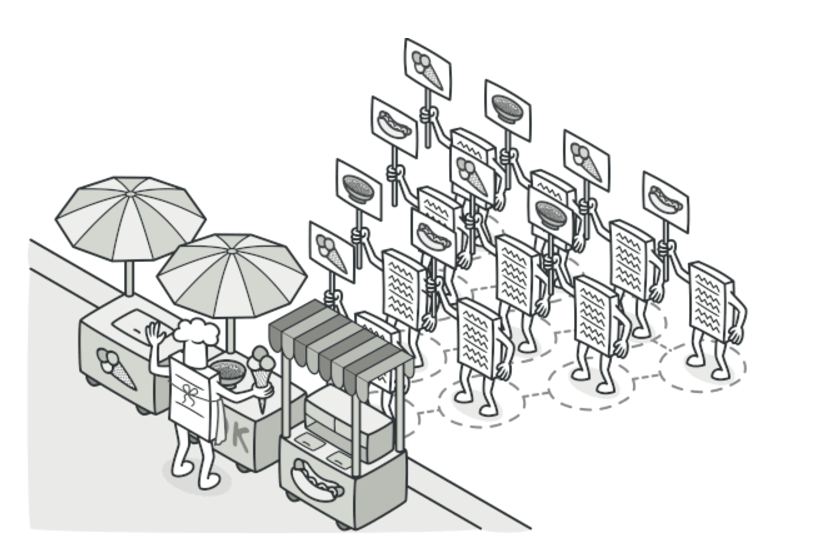

# Concepto
El Patrón Visitor es un patrón de diseño comportamental que permite separar un algoritmo de los objetos sobre los cuales opera. Es útil cuando necesitas realizar operaciones sobre una estructura de objetos heterogénea, pero deseas evitar la proliferación de métodos en las clases.
Facilita añadir nuevas operaciones a una estructura de objetos compleja sin modificar sus clases individuales. En lugar de implementar múltiples métodos en cada clase, se crea un objeto Visitor que encapsula todas las operaciones relacionadas.

## Cuando aplicarlo
- Utiliza el patrón Visitor cuando necesites realizar una operación sobre todos los elementos de una compleja estructura de objetos (por ejemplo, un árbol de objetos).
- Utiliza el patrón Visitor para limpiar la lógica de negocio de comportamientos auxiliares.
- Utiliza el patrón cuando un comportamiento solo tenga sentido en algunas clases de una jerarquía de clases, pero no en otras.

## Caracteristicas Clave
1. Separación de Responsabilidades:
 - La lógica de las operaciones (algoritmos) se extrae de las clases de los objetos y se coloca en las clases del visitante.
 - Esto facilita la adherencia al principio de responsabilidad única (SRP).

2. Extensibilidad de Operaciones:
 - Es fácil añadir nuevas operaciones creando nuevas clases de visitantes, sin necesidad de modificar las clases de los elementos existentes.

3. Interacción Dinámica:
 - El método accept permite a los elementos concretos invocar el método visit correspondiente en el visitante. Esto asegura que la operación adecuada se ejecute para cada tipo de elemento.

4. Dependencia Bidireccional:
 - Existe una relación bidireccional entre los elementos y el visitante. Los elementos deben conocer la interfaz del visitante y viceversa.

5. Mantenimiento de la Estructura de Objetos:
 - El patrón no altera la estructura interna de los elementos. Esto permite mantener sus clases relativamente simples y enfocadas en su propósito original.

## Ventajas
1. Facilita la adición de operaciones:
 - Puedes añadir nuevas operaciones simplemente creando nuevos visitantes sin modificar las clases existentes.
2. Responsabilidad separada:
 - La lógica de las operaciones se separa de la estructura de los objetos, promoviendo el principio de responsabilidad única.

## Desventajas
1. Complejidad inicial:
 - Puede ser complicado de implementar debido a la cantidad de clases y métodos requeridos.
2. Fragilidad ante cambios:
 - Si se añade un nuevo tipo de elemento, todos los visitantes deben actualizarse para manejarlo.