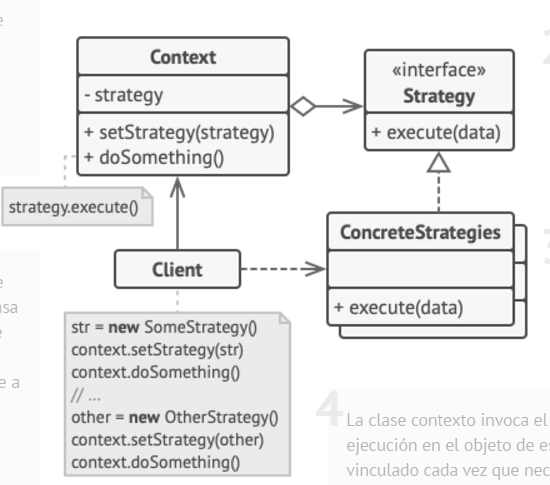

 # Estructura UML


## 1. Contexto (Context)
Es la clase que utiliza una estrategia. Mantiene una referencia a una instancia de la interfaz de estrategia y delega el comportamiento a esa instancia.
    - Responsabilidad: No implementa directamente las variantes del algoritmo, sino que las delega a la estrategia seleccionada.
    - Ejemplo en un sistema de pago: Una clase PaymentProcessor que selecciona una estrategia de pago como CreditCardPayment o PayPalPayment.
### Código de Ejemplo
```js
class PaymentProcessor {
    constructor(strategy) {
        this.strategy = strategy; // Referencia a la estrategia
    }
    processPayment(amount) {
        this.strategy.pay(amount); // Delegación del comportamiento
    }
}
```
## 2. Interfaz de Estrategia (Strategy Interface)
Define un contrato común para todas las estrategias concretas. Esto asegura que el contexto pueda usar diferentes estrategias de manera intercambiable.
 - Responsabilidad: Especificar el método (o métodos) que deben implementar todas las estrategias concretas.
 - Ejemplo en un sistema de compresión de archivos: Una interfaz CompressionAlgorithm con un método compress(data).
### Código de Ejemplo
```js
class CompressionAlgorithm {
    compress(data) {
        throw new Error("Este método debe ser implementado");
    }
}
```

## 3. Estrategias Concretas (Concrete Strategies)
Estas son implementaciones específicas de la interfaz de estrategia. Cada una encapsula un comportamiento o algoritmo particular.
 - Responsabilidad: Implementar un comportamiento específico según las necesidades.
 - Ejemplo en un sistema de compresión: Clases como ZipCompression o RarCompression.
### Código de Ejemplo
```js
class ZipCompression extends CompressionAlgorithm {
    compress(data) {
        console.log("Comprimiendo datos en formato ZIP.");
        // Implementación del algoritmo ZIP
    }
}

class RarCompression extends CompressionAlgorithm {
    compress(data) {
        console.log("Comprimiendo datos en formato RAR.");
        // Implementación del algoritmo RAR
    }
}
```

## 4. Cliente (Client)
Es la clase o el módulo que configura el contexto con una estrategia específica y llama al método del contexto para ejecutar la operación.
 - Responsabilidad: Decidir qué estrategia concreta utilizar, según la lógica de negocio o las necesidades del usuario.
 - Ejemplo en un sistema de selección de algoritmos de búsqueda: El cliente selecciona entre LinearSearch o BinarySearch dependiendo del tipo de datos.
### Código de Ejemplo
```js
const zipStrategy = new ZipCompression();
const rarStrategy = new RarCompression();

const processor = new PaymentProcessor(zipStrategy);
processor.processPayment(100); // Usa ZIP por defecto

// Cambiar a otra estrategia
processor.strategy = rarStrategy;
processor.processPayment(100); // Usa RAR ahora
```