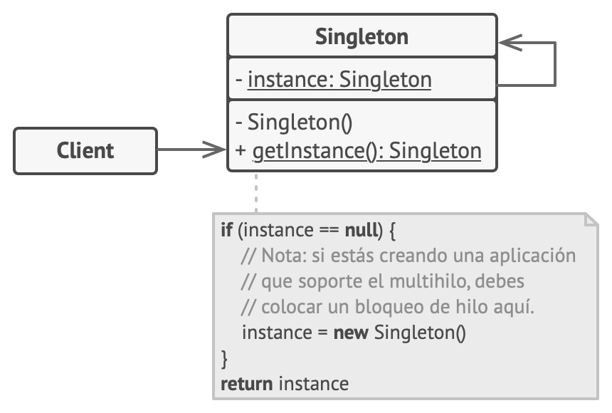

# Estructura UML


## Participantes
La clase **Singleton** declara el método estático obtenerInstancia que devuelve la misma instancia de su propia clase.

El constructor del Singleton debe ocultarse del código cliente. La llamada al método obtenerInstancia debe ser la única manera de obtener el objeto de Singleton.

```js title="Singleton"
class Singleton:
    _instancia = None  # Variable de clase para almacenar la única instancia.

    def __new__(cls, *args, **kwargs):
        raise RuntimeError("Usa 'obtenerInstancia()' para crear una instancia.")  

    @classmethod
    def obtenerInstancia(cls):
        # Si no hay instancia, crea una nueva.
        if cls._instancia is None:
            cls._instancia = super().__new__(cls)
            cls._instancia.__init__()
        return cls._instancia

    # Constructor privado
    def __init__(self):
        if not hasattr(self, "_initialized"):
            self._initialized = True
            # Inicialización del Singleton
            self.data = "Valor inicial del Singleton"

    # Ejemplo de un método para la instancia Singleton.
    def obtenerDatos(self):
        return self.data

    def actualizarDatos(self, valor):
        self.data = valor
```
Código principal que interactúa con el Singleton.
```js title="Cliente"
if __name__ == "__main__":
    # Obtener la instancia del Singleton.
    singleton1 = Singleton.obtenerInstancia()
    print("Datos iniciales:", singleton1.obtenerDatos())

    # Modificar datos a través de la primera instancia.
    singleton1.actualizarDatos("Nuevo valor para el Singleton")
    print("Datos modificados:", singleton1.obtenerDatos())

    # Obtener la instancia nuevamente.
    singleton2 = Singleton.obtenerInstancia()
    print("Datos desde otra referencia:", singleton2.obtenerDatos())

    # Verificar que ambas instancias son iguales.
    print("¿Ambas referencias son iguales?", singleton1 is singleton2)
```
