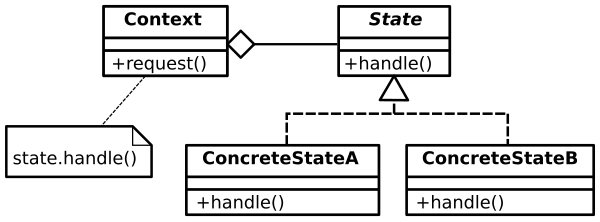

# Estructura UML


## Participantes 
- **Context:** Este integrante define la interfaz con el cliente. Mantiene una instancia de ConcreteState (Estado Concreto) que define su estado actual.

```js title="Context"
class Context:
    def _init_(self):
        self._state = None  # Instancia del estado actual.

    def set_state(self, state):
        print(f"Cambio de estado a {state._class.name_}.")
        self._state = state

    def handle_request(self):
        if self._state:
            self._state.handle_request(self)
        else:
            print("No hay estado inicial definido.")
```

- **State:** Define una interfaz para el encapsulamiento de la responsabilidades asociadas con un estado particular de Context.

```js title="State"
from abc import ABC, abstractmethod

class State(ABC):
    @abstractmethod
    def handle_request(self, context):
        pass
```

- **Subclase ConcreteState:** Cada una de estas subclases implementa el comportamiento o responsabilidad de Context.

```js title="ConcreteState A"
class ConcreteStateA(State):
    def handle_request(self, context):
        print("Estado A: Procesando solicitud.")
        print("Cambiando al estado B.")
        context.set_state(ConcreteStateB())
```
```js title="ConcreteState B"
class ConcreteStateB(State):
    def handle_request(self, context):
        print("Estado B: Procesando solicitud.")
        print("Cambiando al estado A.")
        context.set_state(ConcreteStateA())
```